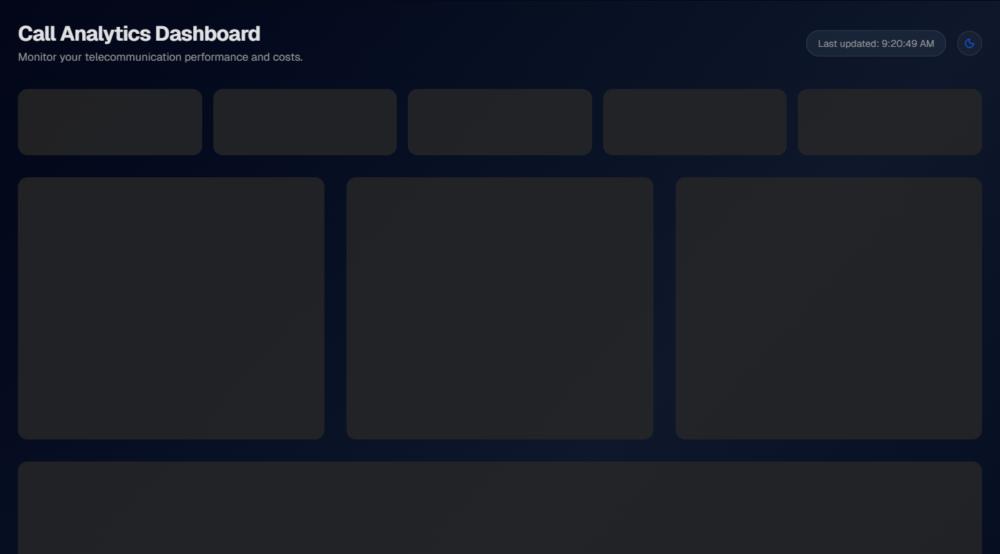

# 📊 Call Analytics Dashboard

A premium, modern SaaS-style dashboard for monitoring and analyzing Telecommunication Call Data Records (CDR). Built with **Next.js 15**, **Tanstack Query**, and **shadcn/ui**, featuring a high-performance architecture and stunning dark mode aesthetics.

🔗 **Live Demo**: [https://call-analytics-dashboard-app.vercel.app](https://call-analytics-dashboard-app.vercel.app)



## 🚀 Key Features

- **Real-time KPI Monitoring**: Track Total Calls, Costs, Average Duration, and Success/Failure rates at a glance.
- **Interactive Analytics**:
  - **Call Duration Insights**: Identify shortest, average, and longest call patterns.
  - **Geographic breakdown**: Top 5 cities by call volume and top 10 by cost.
  - **Activity Timeline**: Visual hourly activity tracking to identify peak hours.
- **Premium User Experience**:
  - 🌙 **Dark/Light Mode**: Seamless theme switching with adaptive chart colors.
  - ✨ **Micro-animations**: Smooth entry effects using Framer Motion.
  - ⚡ **Skeleton Loading**: Graceful loading states for a polished feel.
- **Advanced Data Table**:
  - paginated recent call logs limited to 20 records per page.
  - Data-aware status badges and formatted timestamps.

## 🛠️ Technology Stack

| Role | Technology |
| :--- | :--- |
| **Framework** | [Next.js 15+](https://nextjs.org/) (App Router) |
| **Data Fetching** | [Tanstack Query v5](https://tanstack.com/query) |
| **Styling** | [Tailwind CSS v4](https://tailwindcss.com/) |
| **UI Components** | [shadcn/ui](https://ui.shadcn.com/) |
| **Charts** | [Recharts](https://recharts.org/) |
| **Animations** | [Framer Motion](https://www.framer.com/motion/) |
| **API Client** | [Axios](https://axios-http.com/) |
| **Type Safety** | [TypeScript](https://www.typescriptlang.org/) |

## 📂 Project Structure

Following modern React architecture patterns:

```text
src/
├── app/                  # Next.js App Router (Pages & Layout)
│   └── partials/        # Page-specific complex components (Analytics widgets)
├── components/
│   ├── ui/              # Shadcn primitive components
│   ├── container/       # Global structural components (ThemeToggle)
│   └── animations/      # Framer Motion reusable wrappers
├── hooks/                # Custom React hooks (Tanstack Query logic)
├── services/             # API service layer (Axios instances)
├── types/                # TypeScript interfaces & types
├── constants/            # Static data & configuration
└── lib/                  # Shared utilities (cn, etc.)
```

## 📏 Best Practices & Conventions

- **Naming Conventions**:
  - **Components**: `PascalCase.tsx` (e.g., `KPIStats.tsx`)
  - **Hooks**: `camelCase.ts` (e.g., `useCallRecords.ts`)
  - **Types**: `PascalCase.type.ts` (e.g., `CallRecord.type.ts`)
  - **Page Partials**: `PascalCase.tsx` for consistency within the app directory.
- **Centralized Data**: All static labels and configurations reside in `src/constants/statsData.ts` for easy maintenance.
- **Responsive Design**: Mobile-first approach ensuring the dashboard looks great on all devices.

## 🛠️ Getting Started

### 1. Prerequisites
- Node.js 18+ 
- npm / pnpm / yarn

### 2. Installation
```bash
git clone https://github.com/your-username/call-analytics-dashboard.git
cd call-analytics-dashboard
npm install
```

### 3. Environment Variables
Create a `.env.local` file in the root:
```env
NEXT_PUBLIC_API_URL=https://your-api-endpoint.com/v1
```

### 4. Run Locally
```bash
npm run dev
```

Open [http://localhost:3000](http://localhost:3000) with your browser to see the result.

---
Built with ❤️ for performance and aesthetics.
