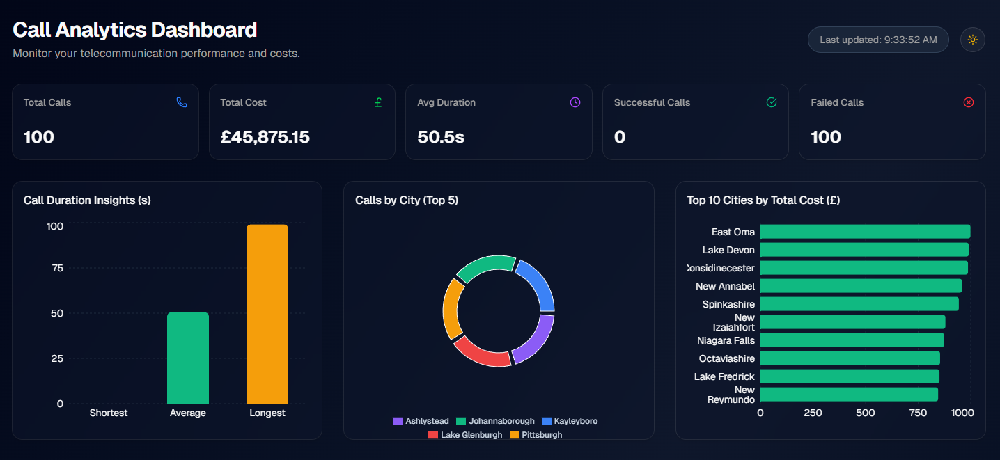
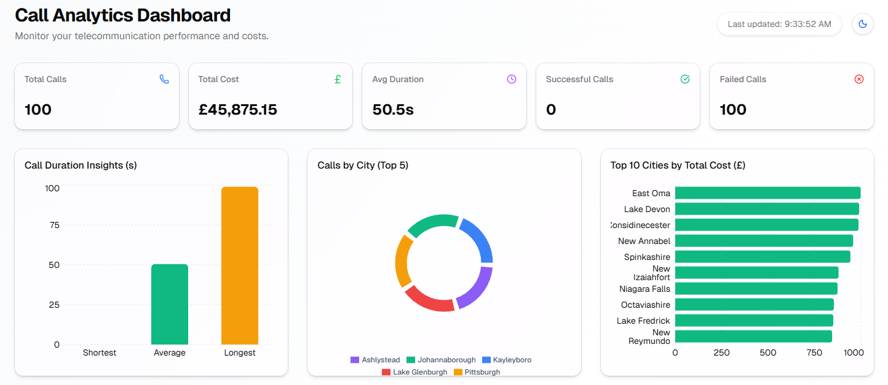
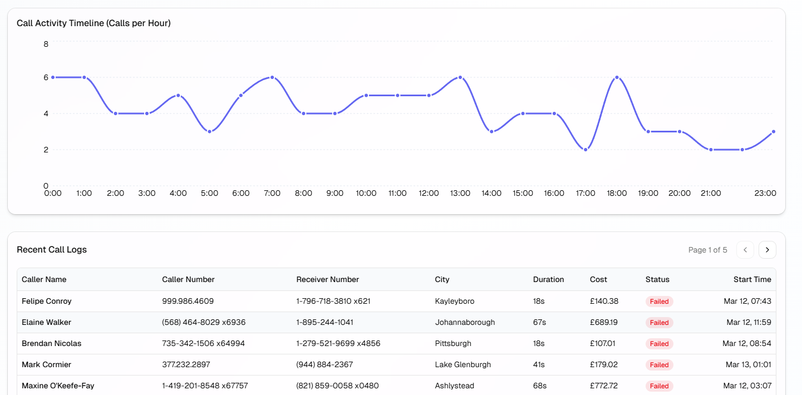

# 📊 Call Analytics Dashboard (Full-Stack)

A premium, modern SaaS-style dashboard for monitoring and analyzing Telecommunication Call Data Records (CDR). This is a **full-stack** application featuring a **Next.js 15** frontend, an **Express.js** backend, and a **MongoDB Atlas** cloud database.

🔗 **Live Demo**: [https://call-analytics-dashboard-app.vercel.app](https://call-analytics-dashboard-app.vercel.app)

<div align="center">
  
  
  
  
</div>

## 🚀 Key Features

- **Full-Stack Integration**: Real-time data synchronization between the Express backend and Next.js frontend.
- **Role-Based Access Control (RBAC)**:
  - 👤 **Analyst**: View-only access to analytics and call logs.
  - 🛡️ **Admin**: Full CRUD permissions (Create, Edit, Delete call records).
- **MongoDB Atlas Cloud**: Persistent data storage with automated seeding from `mock-cdr.csv`.
- **Real-time KPI Monitoring**: Track Total Calls, Costs, Average Duration, and Success/Failure rates.
- **Interactive Analytics**: Duration insights, Geographic breakdowns, and Activity Timelines.
- **Premium UX**: Secure JWT Authentication, Framer Motion animations, and adaptive Dark/Light mode.

## 🛠️ Technology Stack

| Component    | Technology                                                                                                                            |
| :----------- | :------------------------------------------------------------------------------------------------------------------------------------ |
| **Frontend** | [Next.js 15+](https://nextjs.org/), [Tanstack Query v5](https://tanstack.com/query), [Tailwind CSS v4](https://tailwindcss.com/)      |
| **Backend**  | [Node.js](https://nodejs.org/), [Express.js](https://expressjs.com/), [Mongoose](https://mongoosejs.com/)                             |
| **Database** | [MongoDB Atlas](https://www.mongodb.com/atlas) (Free Tier)                                                                            |
| **Security** | [JWT](https://jwt.io/), [bcryptjs](https://www.npmjs.com/package/bcryptjs), [express-validator](https://express-validator.github.io/) |
| **UI Kit**   | [shadcn/ui](https://ui.shadcn.com/), [Recharts](https://recharts.org/), [Framer Motion](https://www.framer.com/motion/)               |

## 📂 Repository Structure

This is a monorepo containing both frontend and backend code:

```text
.
├── backend/              # Node.js Express API
│   ├── src/models/      # MongoDB Mongoose Schemas
│   ├── src/services/    # Business logic & Seeding
│   └── data/            # Source CSV for initial data
├── src/                  # Next.js Frontend
│   ├── app/             # App Router & Auth flows
│   ├── services/        # Frontend API client (Axios)
│   └── providers/       # Auth & Theme context
└── README.md
```

## 🛠️ Getting Started

### 1. Prerequisites

- Node.js 18+
- A [MongoDB Atlas](https://www.mongodb.com/atlas) account (Free tier)

### 2. Backend Setup

```bash
cd backend
npm install
# Create .env based on .env.example
# Add your MONGODB_URI (Atlas Connection String)
npm run dev
```

### 3. Frontend Setup

```bash
# In the root directory
npm install
# Ensure root .env.local points to http://localhost:3001/api
npm run dev
```

## 🔐 Login Credentials (Demo)

| Role        | Email               | Password     |
| :---------- | :------------------ | :----------- |
| **Admin**   | admin@pinevox.com   | Admin@1234   |
| **Analyst** | analyst@pinevox.com | Analyst@1234 |

---

Built with ❤️ for PineVox Telecom Intelligence.
